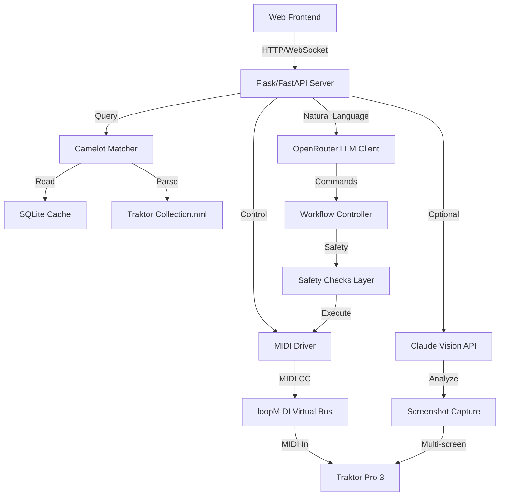

# 🎛️ Traktor AI - Sistema DJ Autonomo

**Sistema DJ autonomo** che controlla Traktor Pro 3 tramite MIDI con intelligenza artificiale, selezione intelligente delle tracce e mixing armonico.

[](https://www.python.org/)
[](LICENSE)
[]()

---

## 📋 Panoramica

Traktor AI è un sistema completo di automazione DJ che combina:

- 🎵 **Controllo MIDI in tempo reale** di Traktor Pro 3 (<10ms latency)
- 🤖 **AI-powered natural language** processing con OpenRouter (modelli gratuiti)
- 🎨 **Intelligent track selection** usando Camelot Wheel per harmonic mixing
- 👁️ **Vision AI** opzionale per analisi interfaccia Traktor (Anthropic Claude)
- 🔒 **Safety layer** per prevenire errori nel mixing professionale
- 🌐 **Web interface** con chat in tempo reale e controlli intuitivi

### Modalità Operative

#### 🆓 Blind Mode (Gratuita - Default)
- ✅ Nessun costo API per Vision
- ✅ Funzionalità core complete (MIDI, navigation, selection)
- ✅ Default values intelligenti (128 BPM, 8A key)
- ✅ Perfetta per testing e uso quotidiano

#### 👁️ Vision Mode (Opzionale - A pagamento)
- 👁️ Screenshot capture e analisi UI Traktor
- 🧠 Claude Vision API per BPM/key detection real-time
- 💰 Costo: ~$0.003 per richiesta API
- 🎯 Massima precisione per performance live critiche

---

## 🚀 Quick Start

### Prerequisiti

1. **Traktor Pro 3** installato e funzionante
2. **loopMIDI** (Windows) o **IAC Driver** (macOS)
   - Nome porta MIDI: `"Traktor MIDI Bus 1"` (Windows) o `"IAC Driver Bus 1"` (macOS)
3. **Audio driver ASIO** (CRITICAL: NON usare WASAPI su Windows!)
4. **Python 3.8+** installato
5. **Git** per clonare il repository

### Installazione Rapida

```bash
# 1. Clona il repository
git clone https://github.com/Fiore0312/traktor.git
cd traktor

# 2. Crea virtual environment (raccomandato)
python -m venv venv

# Windows
.\venv\Scripts\activate

# macOS/Linux
source venv/bin/activate

# 3. Installa dipendenze
pip install -r requirements.txt

# 4. Configura API keys (opzionale per Vision mode)
cp autonomous_dj/config.template.py autonomous_dj/config.py
# Edita config.py e aggiungi le tue API keys

# 5. Verifica setup MIDI
python verify_midi_setup.py

# 6. Avvia il server
START_SERVER_PRODUCTION.bat  # Windows
# oppure
python autonomous_dj/workflow_controller.py  # macOS/Linux
```

### Primo Utilizzo

1. **Apri browser**: http://localhost:8000
2. **Prova questi comandi**:
   - Clicca `"🎧 Auto-Select Compatible"` per trovare traccia compatibile
   - Scrivi: `"Trova una traccia compatibile in D major"`
   - Scrivi: `"Load a techno track on Deck A"`

---

## 🤖 Autonomous DJ System (NEW!)

**Traktor AI può ora suonare DJ set completi senza intervento umano!**

### Quick Start Autonomo

```bash
# Metodo 1: Launcher Script (più facile)
RUN_AUTONOMOUS_DJ.bat

# Metodo 2: Web Interface
# 1. Apri http://localhost:8000
# 2. Clicca "🤖 Start Autonomous Session"

# Metodo 3: Python Script
python -c "from autonomous_dj.autonomous_orchestrator import AutonomousOrchestrator; \
    o = AutonomousOrchestrator(); \
    o.start_session() and o.main_loop(max_tracks=10)"
```

### Cosa Fa il Sistema Autonomo

1. **Carica prima traccia** su Deck A (dalla cartella Techno/Dub/House)
2. **Avvia riproduzione** automaticamente
3. **Monitora timing** - quando <32 bars restano, carica prossima traccia
4. **Selezione intelligente** - usa Camelot Wheel + OpenRouter LLM per trovare traccia compatibile
5. **Mixing automatico** - crossfader transition di 8 secondi tra i deck
6. **Continua indefinitamente** o fino al numero di tracce specificato

### Caratteristiche Chiave

- ✅ **$0 API Costs** - Blind navigation (nessun computer vision)
- ✅ **Intelligent Track Selection** - Camelot Wheel + BPM matching
- ✅ **Smooth Mixing** - Crossfader automatico con timing perfetto
- ✅ **Energy Flow** - Gestione automatica dell'energia del set
- ✅ **Safety Checks** - Previene stati pericolosi del mixer
- ✅ **Position Tracking** - Navigazione MIDI affidabile senza feedback visivo

### Documentazione Completa

Vedi **README_AUTONOMOUS_SYSTEM.md** per:
- 📖 Guida completa all'utilizzo
- 🏗️ Architettura del sistema
- ⚙️ Configurazione dettagliata
- 🧪 Testing e troubleshooting
- 📊 Metriche di performance

---

## 🏗️ Architettura Sistema



### Stack Tecnologico

| Componente | Tecnologia | Scopo |
|-----------|-----------|-------|
| **Frontend** | HTML5 + JavaScript + Tailwind CSS | Interfaccia web utente |
| **Backend** | Flask + FastAPI | API server e WebSocket |
| **AI Engine** | OpenRouter (DeepSeek, Llama 3.2) | Parsing comandi naturali |
| **Vision AI** | Anthropic Claude Vision | Analisi UI Traktor (opzionale) |
| **Music Intelligence** | Camelot Wheel Algorithm | Harmonic mixing |
| **Control** | python-rtmidi | MIDI CC messages |
| **Database** | SQLite | Cache metadata tracce |
| **Config** | JSON | Configurazione sistema |

---

## 🎧 Funzionalità Principali

### 1. Intelligent Track Selection

**Sistema di selezione automatica basato su Camelot Wheel**

- ✅ Compatibilità armonica (±1 ora, stessa ora)
- ✅ Matching BPM range (±6%)
- ✅ Navigazione automatica folder Traktor via MIDI
- ✅ Caricamento sicuro su deck target

**Esempio workflow**:
```python
# User: "Trova una traccia compatibile"
# Sistema:
1. Analizza deck corrente → 128 BPM, 8A (C minor)
2. Query database → trova tracce 7A, 8A, 8B, 9A con BPM 120-136
3. Naviga folder Traktor → seleziona best match
4. Carica su deck target → volume 0 (safety)
```

### 2. Natural Language Control

**Comandi supportati**:

- `"Trova una traccia compatibile"` → auto-select compatible track
- `"Load techno track on Deck A"` → carica genere specifico
- `"Find track in D major"` → ricerca per tonalità
- `"Mix Deck A with Deck B"` → avvia transizione

**Engine LLM**:
- Modelli gratuiti OpenRouter (DeepSeek Chat, Llama 3.2)
- Pattern recognition per comandi DJ-specific
- Context-aware responses

### 3. MIDI Control System

**100+ mappings MIDI CC** per controllo completo:

```json
{
  "browser_navigation": {
    "folder_up": {"cc": 16, "value": 1},
    "folder_down": {"cc": 16, "value": 127},
    "track_up": {"cc": 17, "value": 1},
    "track_down": {"cc": 17, "value": 127}
  },
  "deck_control": {
    "load_deck_a": {"cc": 18, "value": 127},
    "load_deck_b": {"cc": 19, "value": 127},
    "play_pause_a": {"cc": 20, "value": 127}
  }
}
```

**Performance**:
- Latenza < 10ms (real-time)
- Timing preciso con delays configurabili
- Safety checks pre-execution

### 4. Vision System (Opzionale)

**Multi-screen capture** con analisi AI:

- Screenshot automatico di tutti i monitor
- Claude Vision API per OCR e UI analysis
- Detection real-time di BPM, key, deck status
- Fallback automatico a blind mode se API non disponibile

### 5. Safety Layer

**Prevenzione errori critici**:

- ✅ Validazione pre-execution di tutti i comandi MIDI
- ✅ Check volume faders prima di play
- ✅ Verifica MASTER/SYNC logic
- ✅ Compliance con DJ workflow best practices

---

## 📁 Struttura Progetto

```
traktor/
├── autonomous_dj/               # Core system
│   ├── config.py                # ⚠️ NON IN GIT (API keys)
│   ├── config.template.py       # Template per config
│   ├── openrouter_client.py     # LLM client
│   ├── workflow_controller.py   # Orchestrazione
│   ├── traktor_vision.py        # Vision capture
│   └── claude_vision_client.py  # Claude Vision API
│
├── config/                      # Configurazione
│   ├── traktor_midi_mapping.json    # MIDI CC mappings
│   └── keyboard_shortcuts_mapping.json
│
├── camelot_matcher.py           # Algoritmo Camelot Wheel
├── collection_parser_xml.py     # Parser collection.nml
├── midi_navigator.py            # MIDI browser navigation
├── traktor_midi_driver.py       # MIDI driver
├── traktor_safety_checks.py     # Safety rules
│
├── frontend/                    # Web interface
│   └── index.html               # Chat UI
│
├── data/                        # Runtime data (NOT IN GIT)
│   ├── screenshots/             # Vision screenshots
│   ├── logs/                    # Application logs
│   └── backups/                 # Traktor collection backups
│
├── tracks.db                    # SQLite cache (393 tracks)
├── traktor_collection.nml       # Traktor collection (backup)
├── requirements.txt             # Python dependencies
├── .gitignore                   # Protegge API keys
│
└── docs/                        # Documentazione completa
    ├── SETUP.md                 # Setup dettagliato
    ├── INTEGRATION_GUIDE.md     # Guida integrazione
    ├── VISION_GUIDE.md          # Vision system
    ├── API_REFERENCE.md         # API docs
    ├── CAMELOT_WHEEL_GUIDE.md   # Harmonic mixing theory
    ├── TROUBLESHOOTING.md       # Risoluzione problemi
    └── DEVELOPMENT.md           # Guida sviluppatori
```

---

## 🔑 Configurazione

### API Keys (Opzionale - Solo per Vision Mode)

```bash
# 1. Copia template
cp autonomous_dj/config.template.py autonomous_dj/config.py

# 2. Edita config.py
nano autonomous_dj/config.py
```

```python
# autonomous_dj/config.py
ANTHROPIC_API_KEY = "sk-ant-api03-YOUR-KEY-HERE"  # Per Vision mode
OPENROUTER_API_KEY = "sk-or-v1-YOUR-KEY-HERE"     # Gratuito!
```

**Get API Keys**:
- **Anthropic**: https://console.anthropic.com/settings/keys (opzionale)
- **OpenRouter**: https://openrouter.ai/keys (gratuito)

### Configurazione Sistema

**`config/config.json`**:
```json
{
  "use_vision": false,
  "midi": {
    "port_name": "Traktor MIDI Bus 1",
    "delays": {
      "between_commands": 0.1,
      "folder_navigation": 0.3,
      "track_navigation": 0.2
    }
  }
}
```

**⚠️ IMPORTANTE**:
- `config.py` è in `.gitignore` - mai committato!
- Usa `config.template.py` come reference

---

## 🎯 Utilizzo

### Web Interface

```bash
# Avvia server
START_SERVER_PRODUCTION.bat

# Apri browser
http://localhost:8000
```

**Comandi supportati**:
- `"Trova una traccia compatibile"` → auto-select
- `"Load track in C minor"` → ricerca tonalità
- `"Mix Deck A and B"` → avvia transizione
- Clicca `"🎧 Auto-Select Compatible"` → instant match

### Workflow Tipico

1. **Setup Iniziale**
   ```bash
   # Parse collection Traktor (una volta)
   python collection_parser_xml.py

   # Verifica: dovrebbe creare tracks.db
   ls -lh tracks.db  # 393 tracce analizzate
   ```

2. **Avvia Sistema**
   ```bash
   # Windows
   START_SERVER_PRODUCTION.bat

   # macOS/Linux
   python autonomous_dj/workflow_controller.py
   ```

3. **Interazione**
   - Apri http://localhost:8000
   - Usa chat per comandi naturali
   - Monitor status in tempo reale

---

## 🧪 Testing

```bash
# Test MIDI connection
python verify_midi_setup.py

# Test vision system (opzionale)
python test_claude_vision.py

# Test intelligent selection
python test_intelligent_integration.py

# Test complete workflow
python test_vision_workflow_single.py
```

**Expected output**:
```
✅ MIDI driver initialized
✅ Traktor MIDI Bus 1 found
✅ Collection parsed: 393 tracks
✅ Camelot matcher ready
✅ Vision system active (blind mode)
```

---

## 📚 Documentazione Completa

### Quick Links

- **[SETUP.md](docs/SETUP.md)** - Istruzioni setup dettagliate (MIDI, Traktor TSI, API keys)
- **[INTEGRATION_GUIDE.md](docs/INTEGRATION_GUIDE.md)** - Come funziona l'integrazione completa
- **[VISION_GUIDE.md](docs/VISION_GUIDE.md)** - Vision mode vs Blind mode, costi, setup
- **[API_REFERENCE.md](docs/API_REFERENCE.md)** - Tutti gli endpoints API disponibili
- **[CAMELOT_WHEEL_GUIDE.md](docs/CAMELOT_WHEEL_GUIDE.md)** - Teoria harmonic mixing
- **[TROUBLESHOOTING.md](docs/TROUBLESHOOTING.md)** - Risoluzione problemi comuni
- **[DEVELOPMENT.md](docs/DEVELOPMENT.md)** - Guida per contribuire al progetto

### File Chiave

- **`CLAUDE.md`** - Context per Claude Code
- **`DJ_WORKFLOW_RULES.md`** - Best practices DJ professionali
- **`MIDI_INTERACTION_MODE_FIX.md`** - Critical MIDI setup
- **`README_INTEGRATION_COMPLETE.md`** - Integration success summary

---

## ⚠️ Troubleshooting Rapido

### MIDI Non Funziona

```bash
# 1. Verifica audio driver
# Traktor → Preferences → Audio Setup → Audio Device
# DEVE essere ASIO (NON WASAPI!)

# 2. Verifica loopMIDI
# Windows: apri loopMIDI → "Traktor MIDI Bus 1" deve esistere

# 3. Verifica Interaction Mode
# Traktor → Preferences → Controller Manager
# "MIDI Interaction Mode" = "Direct" (NON "Toggle"!)

# 4. Run diagnostics
python verify_midi_setup.py
```

### Vision API Errors

```bash
# Passa a blind mode (gratuito)
# Edit config/config.json:
{
  "use_vision": false
}

# Restart server
```

### Collection Non Trovata

```bash
# Re-parse collection
python collection_parser_xml.py

# Verifica output
ls -lh tracks.db  # Deve esistere
```

**Per troubleshooting completo**: vedi [TROUBLESHOOTING.md](docs/TROUBLESHOOTING.md)

---

## 🗺️ Roadmap

### ✅ Phase 1: Core Backend (COMPLETE)
- [x] MIDI driver implementation
- [x] Vision system (multi-screen)
- [x] Claude Vision AI integration
- [x] Safety layer
- [x] Track matching algorithm

### ✅ Phase 2: Full-Stack App (COMPLETE)
- [x] Web frontend (chat UI)
- [x] Flask/FastAPI server
- [x] WebSocket real-time updates
- [x] OpenRouter LLM integration
- [x] Intelligent track selection

### 🔄 Phase 3: Advanced AI (IN PROGRESS)
- [x] Camelot Wheel matching
- [ ] Energy flow analysis
- [ ] Phrase-aware mixing
- [ ] Persistent memory (ChromaDB)
- [ ] Auto-EQ/FX recommendations

### 🔮 Phase 4: Professional Features (PLANNED)
- [ ] Live performance mode
- [ ] Multi-deck support (4 decks)
- [ ] Recording/export mixes
- [ ] Cloud sync playlists
- [ ] Mobile app (iOS/Android)

---

## 🤝 Contributing

Contributi benvenuti! Per favore:

1. Fork il repository
2. Crea branch (`git checkout -b feature/AmazingFeature`)
3. Commit changes (`git commit -m 'Add AmazingFeature'`)
4. Push to branch (`git push origin feature/AmazingFeature`)
5. Apri Pull Request

Vedi [DEVELOPMENT.md](docs/DEVELOPMENT.md) per guidelines complete.

---

## 📄 License

Questo progetto è rilasciato sotto licenza MIT. Vedi `LICENSE` file per dettagli.

---

## 🙏 Credits

**Sviluppato da**: DJ Fiore
**AI Engine**: OpenRouter (DeepSeek, Llama 3.2)
**Vision AI**: Anthropic Claude
**Framework**: Python + Flask + MIDI

**Special Thanks**:
- Traktor Pro 3 (Native Instruments)
- OpenRouter community
- Camelot Wheel creators (Mark Davis)

---

## 📞 Support & Community

- **Issues**: [GitHub Issues](https://github.com/Fiore0312/traktor/issues)
- **Discussions**: [GitHub Discussions](https://github.com/Fiore0312/traktor/discussions)
- **Email**: [your-email@example.com]

---

**Made with ❤️ for the DJ community**

*Last updated: October 26, 2025*
