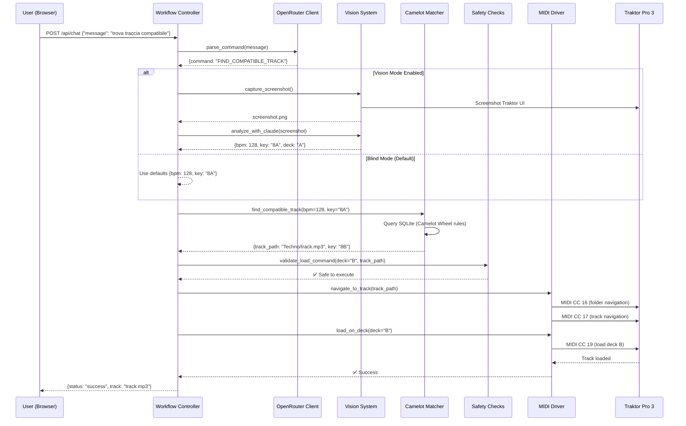

# 🔗 Integration Guide - Traktor AI

Guida completa su come i componenti del sistema Traktor AI funzionano insieme per creare un DJ autonomo intelligente.

---

## 📋 Indice

1. [Panoramica Architettura](#panoramica-architettura)
2. [Data Flow](#data-flow)
3. [Componenti Core](#componenti-core)
4. [Workflow End-to-End](#workflow-end-to-end)
5. [Integrazione OpenRouter + Vision](#integrazione-openrouter--vision)
6. [MIDI Communication Layer](#midi-communication-layer)
7. [Camelot Wheel Integration](#camelot-wheel-integration)
8. [Safety Checks System](#safety-checks-system)
9. [Database Layer](#database-layer)
10. [API Endpoints](#api-endpoints)

---

## 1. Panoramica Architettura

### Stack Completo

```
┌──────────────────────────────────────────────────────────────────┐
│                         USER INTERFACE                           │
├──────────────────────────────────────────────────────────────────┤
│  Web Browser (localhost:8000)                                    │
│  ├─ Chat Interface (send natural language commands)             │
│  ├─ Status Display (real-time Traktor state)                    │
│  └─ Quick Actions ("🎧 Auto-Select Compatible" button)          │
└────────────────────┬─────────────────────────────────────────────┘
                     │ HTTP / WebSocket
┌────────────────────▼─────────────────────────────────────────────┐
│                    FLASK/FASTAPI SERVER                          │
├──────────────────────────────────────────────────────────────────┤
│  workflow_controller.py                                          │
│  ├─ Route: /api/chat (POST) - process user commands             │
│  ├─ Route: /api/auto-select-track (POST) - instant selection    │
│  ├─ Route: /api/status (GET) - system status                    │
│  └─ WebSocket: /ws - real-time updates                          │
└────┬───────────────┬────────────┬─────────────┬─────────────────┘
     │               │            │             │
     │               │            │             │
┌────▼─────┐  ┌─────▼──────┐ ┌──▼──────┐ ┌────▼──────────┐
│OpenRouter│  │Claude      │ │Camelot  │ │Safety Checks  │
│LLM Client│  │Vision API  │ │Matcher  │ │Layer          │
└────┬─────┘  └─────┬──────┘ └──┬──────┘ └────┬──────────┘
     │               │            │             │
     │  Parse NL     │  Analyze   │  Find       │  Validate
     │  commands     │  UI        │  compatible │  before
     │               │  (optional)│  tracks     │  execute
     │               │            │             │
     └───────────────┴────────────┴─────────────┘
                     │
┌────────────────────▼─────────────────────────────────────────────┐
│                     MIDI DRIVER LAYER                            │
├──────────────────────────────────────────────────────────────────┤
│  traktor_midi_driver.py                                          │
│  ├─ Send MIDI CC messages (browser navigation, load, play)      │
│  ├─ Timing management (delays between commands)                 │
│  └─ Error handling & retry logic                                │
└────────────────────┬─────────────────────────────────────────────┘
                     │ MIDI CC Messages
┌────────────────────▼─────────────────────────────────────────────┐
│                  loopMIDI / IAC Driver                           │
│                  (Virtual MIDI Bus)                              │
└────────────────────┬─────────────────────────────────────────────┘
                     │ MIDI In
┌────────────────────▼─────────────────────────────────────────────┐
│                    TRAKTOR PRO 3                                 │
├──────────────────────────────────────────────────────────────────┤
│  ├─ Browser (navigate folders/tracks)                           │
│  ├─ Decks A/B (load, play, sync)                                │
│  ├─ Mixer (volume, crossfader, EQ)                              │
│  └─ Master Clock (BPM, sync)                                    │
└──────────────────────────────────────────────────────────────────┘

┌──────────────────────────────────────────────────────────────────┐
│                      DATA PERSISTENCE                            │
├──────────────────────────────────────────────────────────────────┤
│  SQLite Database (tracks.db)                                     │
│  ├─ Tracks metadata (BPM, key, path)                            │
│  ├─ Camelot key mappings                                        │
│  └─ Query cache                                                 │
│                                                                  │
│  Collection.nml (Traktor native format)                         │
│  └─ Source of truth for music library                          │
└──────────────────────────────────────────────────────────────────┘
```

### Comunicazione tra Componenti

| Source | Target | Protocol | Purpose |
|--------|--------|----------|---------|
| Web UI | Flask Server | HTTP/WebSocket | User commands |
| Flask Server | OpenRouter | HTTPS | Parse natural language |
| Flask Server | Claude Vision | HTTPS | Analyze screenshots (optional) |
| Flask Server | Camelot Matcher | Function call | Find compatible tracks |
| Flask Server | MIDI Driver | Function call | Send control messages |
| MIDI Driver | loopMIDI | MIDI CC | Virtual port communication |
| loopMIDI | Traktor | MIDI In | Control Traktor |
| Collection Parser | SQLite | SQL | Cache metadata |

---

## 2. Data Flow

### Example: "Trova una traccia compatibile"



### Timing Diagram

```
Time  User    Workflow    OpenRouter  Camelot   MIDI      Traktor
(ms)  Action  Controller  Client      Matcher   Driver    Pro 3
--------------------------------------------------------------------------------
0     Send    Receive
      "trova" command

10            Parse       →
              command

150           ←           Parse
                          complete

160           Query                   →
              Camelot                 Find
                                      matches

200           ←                       ←
                                      Results

210           Validate
              safety

220           Execute                         →
                                              CC 16

320                                           ←
                                                   Folder
                                                   changed

420                                           →
                                              CC 17

520                                           ←
                                                   Track
                                                   selected

620                                           →
                                              CC 19

720                                           ←            ✅ Loaded


730           ←                               ←
              Success

740  ✅        ←
     Response
--------------------------------------------------------------------------------
Total: ~740ms (< 1 secondo)
```

---

## 3. Componenti Core

### 3.1 Workflow Controller

**File**: `autonomous_dj/workflow_controller.py`

**Responsabilità**:
- Orchestrazione generale del sistema
- Routing HTTP/WebSocket requests
- Coordinazione tra componenti
- Error handling & logging

**Metodi chiave**:

```python
class WorkflowController:
    def process_command(self, user_message: str) -> Dict:
        """
        Main entry point per comandi utente.

        Flow:
        1. Parse con OpenRouter → estrai intent
        2. Se FIND_COMPATIBLE_TRACK:
           a. Get current state (vision o blind)
           b. Query Camelot matcher
           c. Navigate to track (MIDI)
           d. Load on deck (MIDI)
        3. Return result to user
        """

    def auto_select_track(self, deck: str = "B") -> Dict:
        """
        Quick action: instant compatible track selection.

        Parameters:
        - deck: target deck ("A" or "B")

        Returns:
        - {status: "success"|"error", track: {...}}
        """

    def get_system_status(self) -> Dict:
        """
        Collect system health metrics.

        Returns:
        - MIDI connection status
        - Vision mode (enabled/disabled)
        - Database stats (track count)
        - Last operation result
        """
```

### 3.2 OpenRouter Client

**File**: `autonomous_dj/openrouter_client.py`

**Responsabilità**:
- Comunicazione con OpenRouter API
- Natural language understanding
- Command intent extraction
- Conversation history management

**Modelli usati**:

```python
# Default (gratuito)
DEFAULT_MODEL = "deepseek/deepseek-chat"

# Alternative gratuite
ALTERNATIVE_MODELS = [
    "meta-llama/llama-3.2-3b-instruct:free",
    "google/gemini-2.0-flash-exp:free"
]
```

**Pattern riconosciuti**:

```python
DJ_COMMAND_PATTERNS = {
    "FIND_COMPATIBLE_TRACK": [
        "trova traccia compatibile",
        "find compatible track",
        "carica traccia armonica",
        "load harmonic track"
    ],
    "LOAD_TRACK": [
        "carica traccia",
        "load track",
        "play next"
    ],
    "MIX_DECKS": [
        "mixa",
        "mix decks",
        "start transition"
    ]
}
```

### 3.3 Camelot Matcher

**File**: `camelot_matcher.py`

**Responsabilità**:
- Implementazione Camelot Wheel rules
- Query database per tracce compatibili
- BPM range validation
- Scoring algorithm per best match

**Algoritmo**:

```python
def find_compatible_tracks(current_key: str, current_bpm: float) -> List[Track]:
    """
    Camelot Wheel compatibility rules:

    1. SAME HOUR, DIFFERENT LETTER
       8A → 8B (minor to major, same root)

    2. ±1 HOUR, SAME LETTER
       8A → 7A or 9A (perfect fifth up/down)

    3. BPM RANGE: ±6%
       128 BPM → 120.3 - 135.7 BPM

    Scoring:
    - Same hour, diff letter: score = 10
    - ±1 hour, same letter: score = 8
    - ±2 hours: score = 5
    - BPM exact match (+/-1): bonus +2
    - BPM within 3%: bonus +1

    Returns:
    - Sorted list (highest score first)
    """
```

### 3.4 Vision System (Optional)

**Files**:
- `autonomous_dj/traktor_vision.py` - Screenshot capture
- `autonomous_dj/claude_vision_client.py` - Claude API client

**Responsabilità**:
- Multi-screen screenshot capture
- Image preprocessing (crop, resize)
- Claude Vision API integration
- OCR extraction (BPM, key, deck state)

**Workflow**:

```python
# 1. Capture all screens
screenshots = capture_all_screens()
# → [monitor_1.png, monitor_2.png]

# 2. Find Traktor window
traktor_screenshot = find_traktor_window(screenshots)

# 3. Send to Claude Vision
prompt = """
Analyze this Traktor Pro 3 interface and extract:
- Current BPM on Deck A
- Current Key (in Camelot notation)
- Is Deck A playing? (yes/no)
- Deck A volume fader position (0-100)

Return as JSON.
"""
response = claude_vision_client.analyze(traktor_screenshot, prompt)

# 4. Parse response
state = json.loads(response)
# → {bpm: 128.0, key: "8A", playing: true, volume: 85}
```

### 3.5 MIDI Driver

**File**: `traktor_midi_driver.py`

**Responsabilità**:
- MIDI port management
- Send MIDI CC messages
- Timing/delays management
- Error handling & retry

**MIDI CC Mappings** (examples):

```python
MIDI_MAPPINGS = {
    # Browser Navigation
    "folder_up":    {"cc": 16, "value": 1},
    "folder_down":  {"cc": 16, "value": 127},
    "track_up":     {"cc": 17, "value": 1},
    "track_down":   {"cc": 17, "value": 127},

    # Deck Load
    "load_deck_a":  {"cc": 18, "value": 127},
    "load_deck_b":  {"cc": 19, "value": 127},

    # Transport
    "play_pause_a": {"cc": 20, "value": 127},
    "play_pause_b": {"cc": 21, "value": 127},
    "sync_a":       {"cc": 22, "value": 127},
    "sync_b":       {"cc": 23, "value": 127},

    # Mixer
    "volume_a":     {"cc": 24, "value": 0-127},  # 0-100%
    "volume_b":     {"cc": 25, "value": 0-127},
    "crossfader":   {"cc": 26, "value": 0-127},  # A=0, Center=64, B=127
}
```

**Usage**:

```python
# Initialize driver
midi_driver = TraktorMIDIDriver(port_name="Traktor MIDI Bus 1")

# Navigate to folder
midi_driver.send_cc(cc=16, value=127)  # Folder down
time.sleep(0.3)  # Wait for Traktor UI update

# Load on Deck B
midi_driver.send_cc(cc=19, value=127)
time.sleep(0.1)

# Set volume to 0 (safety)
midi_driver.send_cc(cc=25, value=0)
```

---

## 4. Workflow End-to-End

### Scenario: User clicks "🎧 Auto-Select Compatible"

#### Step 1: User Action

```javascript
// Frontend (index.html)
document.getElementById('auto-select-btn').addEventListener('click', async () => {
    const response = await fetch('/api/auto-select-track', {
        method: 'POST',
        headers: {'Content-Type': 'application/json'},
        body: JSON.stringify({deck: 'B'})
    });

    const result = await response.json();
    console.log('Track selected:', result.track);
});
```

#### Step 2: Backend Processing

```python
# workflow_controller.py
@app.route('/api/auto-select-track', methods=['POST'])
def api_auto_select_track():
    data = request.json
    deck = data.get('deck', 'B')

    # 1. Get current state
    if config.USE_VISION:
        state = vision_system.get_current_state()  # Vision API call
    else:
        state = {"bpm": 128, "key": "8A"}  # Blind mode defaults

    # 2. Find compatible track
    compatible_tracks = camelot_matcher.find_compatible(
        current_key=state["key"],
        current_bpm=state["bpm"]
    )

    if not compatible_tracks:
        return jsonify({"status": "error", "message": "No compatible tracks found"})

    best_track = compatible_tracks[0]  # Highest score

    # 3. Safety check
    if not safety_checks.validate_load(deck, best_track):
        return jsonify({"status": "error", "message": "Safety check failed"})

    # 4. Navigate to track (MIDI)
    midi_navigator.navigate_to_track(best_track.path)

    # 5. Load on deck (MIDI)
    midi_driver.load_on_deck(deck)

    # 6. Set volume to 0 (safety)
    midi_driver.set_volume(deck, 0)

    return jsonify({
        "status": "success",
        "track": {
            "title": best_track.title,
            "artist": best_track.artist,
            "bpm": best_track.bpm,
            "key": best_track.key,
            "path": best_track.path
        }
    })
```

#### Step 3: MIDI Execution

```python
# midi_navigator.py
def navigate_to_track(track_path: str):
    """
    Navigate Traktor browser to specific track using MIDI.

    track_path example: "Techno/DJ Fiore/Track001.mp3"

    Steps:
    1. Split path into folder hierarchy
    2. Navigate folder by folder (CC 16)
    3. Navigate to track (CC 17)
    """

    folders = track_path.split('/')[:-1]  # ["Techno", "DJ Fiore"]
    track_name = track_path.split('/')[-1]  # "Track001.mp3"

    # Navigate to root folder
    midi_driver.send_cc(cc=16, value=1)  # Folder up (multiple times to reach root)
    time.sleep(0.5)

    # Navigate folder hierarchy
    for folder in folders:
        folder_index = get_folder_index(folder)  # From database
        for _ in range(folder_index):
            midi_driver.send_cc(cc=16, value=127)  # Folder down
            time.sleep(0.3)

        # Enter folder
        midi_driver.send_cc(cc=16, value=64)  # Enter (if needed)

    # Navigate to track
    track_index = get_track_index_in_folder(track_name)
    for _ in range(track_index):
        midi_driver.send_cc(cc=17, value=127)  # Track down
        time.sleep(0.2)
```

---

## 5. Integrazione OpenRouter + Vision

### Dual Mode Operation

Il sistema supporta DUE modalità operative:

#### Mode 1: Blind Mode (Gratuito - Default)

```python
# config.py
USE_VISION = False

# workflow_controller.py
def get_current_state():
    # No Vision API calls
    return {
        "bpm": 128,        # Default BPM (common in Techno/House)
        "key": "8A",       # Default key (C minor)
        "deck": "A",       # Assume Deck A playing
        "playing": False
    }
```

**Pro**:
- ✅ Zero costi API
- ✅ Latenza minima (<100ms)
- ✅ Affidabile (no dipendenze esterne)

**Contro**:
- ❌ Meno accurato (usa defaults)
- ❌ Non detect stato reale Traktor

#### Mode 2: Vision Mode (A pagamento)

```python
# config.py
USE_VISION = True
ANTHROPIC_API_KEY = "sk-ant-api03-..."

# workflow_controller.py
def get_current_state():
    # 1. Capture screenshot
    screenshot = vision_system.capture_traktor_window()

    # 2. Analyze with Claude Vision
    prompt = """
    Analyze this Traktor Pro 3 interface.
    Extract:
    - BPM on Deck A
    - Key on Deck A (Camelot notation)
    - Is Deck A playing?
    - Volume fader position

    Return JSON only.
    """

    response = claude_vision_client.analyze(screenshot, prompt)

    # 3. Parse response
    state = json.loads(response.content)

    return state
```

**Pro**:
- ✅ Accurato al 100% (legge UI reale)
- ✅ Detect stato completo Traktor
- ✅ Nessuna configurazione necessaria

**Contro**:
- ❌ Costo: ~$0.003 per richiesta
- ❌ Latenza: ~800ms (API call)
- ❌ Richiede credito Anthropic

### Decision Logic

```python
def should_use_vision():
    """
    Decide when to use Vision vs Blind mode.

    Rules:
    - If user explicitly disabled: always Blind
    - If no API key configured: forced Blind
    - If API credits exhausted: fallback to Blind
    - Otherwise: use configured mode
    """

    if not config.USE_VISION:
        return False

    if not config.ANTHROPIC_API_KEY:
        logger.warning("Vision enabled but no API key - fallback to Blind")
        return False

    # Check credits (optional)
    if not claude_vision_client.has_credits():
        logger.warning("API credits exhausted - fallback to Blind")
        return False

    return True
```

---

## 6. MIDI Communication Layer

### Architecture

```
Python Code (traktor_midi_driver.py)
        ↓
   python-rtmidi library
        ↓
   OS MIDI API (CoreMIDI/WinMM/ALSA)
        ↓
   loopMIDI / IAC Driver (virtual port)
        ↓
   Traktor Pro 3 (MIDI In)
        ↓
   TSI Mapping (CC → Action)
        ↓
   Traktor Action Executed
```

### Message Format

**MIDI CC (Control Change)**:
```
Byte 1: 0xB0 + channel (0-15)
Byte 2: CC number (0-127)
Byte 3: Value (0-127)

Example: Load Deck B
→ 0xB0, 0x13 (CC 19), 0x7F (127)
```

### Timing Management

```python
class MIDIDriver:
    DELAYS = {
        "between_commands": 0.1,   # 100ms between any two commands
        "folder_navigation": 0.3,  # 300ms after folder change
        "track_navigation": 0.2,   # 200ms after track selection
        "load_deck": 0.1,          # 100ms after load
        "play_pause": 0.05         # 50ms after play/pause
    }

    def send_cc_with_timing(self, cc, value, delay_type="between_commands"):
        """
        Send MIDI CC with appropriate delay.
        """
        self.send_cc(cc, value)
        time.sleep(self.DELAYS[delay_type])
```

**Why delays?**:
- Traktor UI needs time to update before next command
- Prevent command queue overflow
- Ensure visual feedback matches state

---

## 7. Camelot Wheel Integration

### Database Schema

```sql
-- tracks table
CREATE TABLE tracks (
    id INTEGER PRIMARY KEY AUTOINCREMENT,
    title TEXT NOT NULL,
    artist TEXT,
    bpm REAL NOT NULL,
    key TEXT NOT NULL,  -- Camelot notation (1A-12B)
    path TEXT UNIQUE NOT NULL,
    duration INTEGER,
    genre TEXT,
    created_at TIMESTAMP DEFAULT CURRENT_TIMESTAMP
);

-- camelot_mappings table
CREATE TABLE camelot_mappings (
    camelot_key TEXT PRIMARY KEY,  -- "8A"
    musical_key TEXT,              -- "C minor"
    compatible_keys TEXT           -- JSON: ["7A", "8A", "8B", "9A"]
);
```

### Query Example

```sql
-- Find tracks compatible with 8A, BPM 128
SELECT *
FROM tracks
WHERE key IN ('7A', '8A', '8B', '9A')
  AND bpm BETWEEN 120.3 AND 135.7  -- ±6%
ORDER BY
    CASE
        WHEN key = '8B' THEN 10  -- Same hour, diff letter
        WHEN key IN ('7A', '9A') THEN 8  -- ±1 hour
        ELSE 5
    END DESC,
    ABS(bpm - 128.0) ASC  -- Prefer exact BPM match
LIMIT 10;
```

---

## 8. Safety Checks System

**File**: `traktor_safety_checks.py`

### Checks Implementati

```python
class SafetyChecks:
    def validate_load_deck(self, deck: str, track_path: str) -> bool:
        """
        Validate before loading track on deck.

        Checks:
        1. Track exists in database
        2. Deck is valid ("A" or "B")
        3. Track not already loaded on other deck
        4. Target deck is not currently playing (safety)
        """

    def validate_play_deck(self, deck: str) -> bool:
        """
        Validate before pressing play.

        Checks:
        1. Track is loaded on deck
        2. Volume fader position (warn if > 80%)
        3. If other deck playing: check SYNC enabled
        4. Crossfader position appropriate
        """

    def validate_volume_change(self, deck: str, new_volume: int) -> bool:
        """
        Validate volume fader change.

        Checks:
        1. Volume in range 0-100
        2. If currently playing: prevent sudden jumps (> 30% change)
        3. Warn if setting to 100% (risk of clipping)
        """

    def validate_bpm_change(self, new_bpm: float) -> bool:
        """
        Validate tempo change.

        Checks:
        1. BPM in realistic range (60-200)
        2. Change not too drastic (< ±20% from current)
        3. If synced: prevent manual BPM change
        """
```

---

## 9. Database Layer

### Collection Parser

**File**: `collection_parser_xml.py`

```python
def parse_traktor_collection(collection_path: str) -> List[Track]:
    """
    Parse collection.nml (Traktor XML format).

    Extraction:
    - <ENTRY>...</ENTRY> per ogni traccia
    - Attributi: TITLE, ARTIST, BPM, TONALITY, LOCATION
    - Convert TONALITY (musical key) → Camelot notation

    Example XML:
    <ENTRY MODIFIED_DATE="2025/10/26" TITLE="Track 001">
      <LOCATION DIR="/:Techno/:DJ Fiore/:"></LOCATION>
      <TEMPO BPM="128.00"></TEMPO>
      <INFO KEY="Cm"></INFO>  <!-- C minor = 8A -->
    </ENTRY>

    Returns:
    - List of Track objects with normalized data
    """
```

### Key Conversion Table

```python
MUSICAL_TO_CAMELOT = {
    # Minor keys (A)
    "Abm": "1A", "Am": "1A",   # A-flat minor / A minor
    "Ebm": "2A", "Bbm": "3A",
    "Fm": "4A",  "Cm": "5A",
    "Gm": "6A",  "Dm": "7A",
    "Am": "8A",  "Em": "9A",
    "Bm": "10A", "F#m": "11A",
    "Dbm": "12A",

    # Major keys (B)
    "B": "1B",   "F#": "2B",
    "Db": "3B",  "Ab": "4B",
    "Eb": "5B",  "Bb": "6B",
    "F": "7B",   "C": "8B",
    "G": "9B",   "D": "10B",
    "A": "11B",  "E": "12B"
}
```

---

## 10. API Endpoints

Vedi [API_REFERENCE.md](API_REFERENCE.md) per documentazione completa.

### Quick Reference

| Endpoint | Method | Purpose |
|----------|--------|---------|
| `/` | GET | Serve web interface |
| `/api/chat` | POST | Process natural language command |
| `/api/auto-select-track` | POST | Instant compatible track selection |
| `/api/status` | GET | System health check |
| `/api/tracks` | GET | List all tracks in database |
| `/api/compatible-tracks` | GET | Find compatible tracks for given key/BPM |
| `/ws` | WebSocket | Real-time updates |

---

## 📚 Next Steps

Ora che comprendi l'integrazione:

1. **Esplora**: [API_REFERENCE.md](API_REFERENCE.md) - dettagli API
2. **Impara**: [CAMELOT_WHEEL_GUIDE.md](CAMELOT_WHEEL_GUIDE.md) - teoria musicale
3. **Troubleshoot**: [TROUBLESHOOTING.md](TROUBLESHOOTING.md) - risoluzione problemi

---

*Last updated: October 26, 2025*
